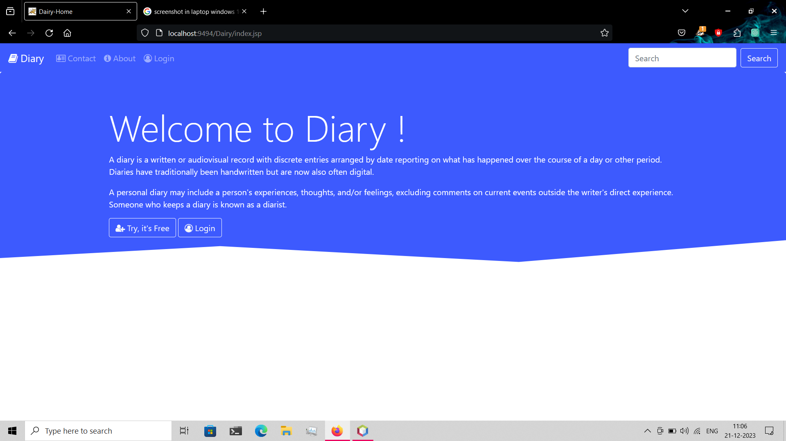
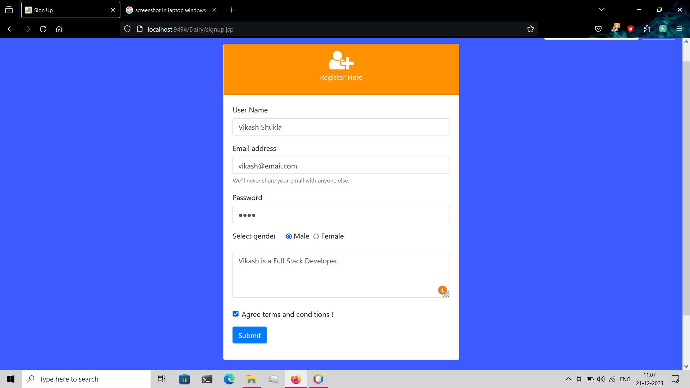
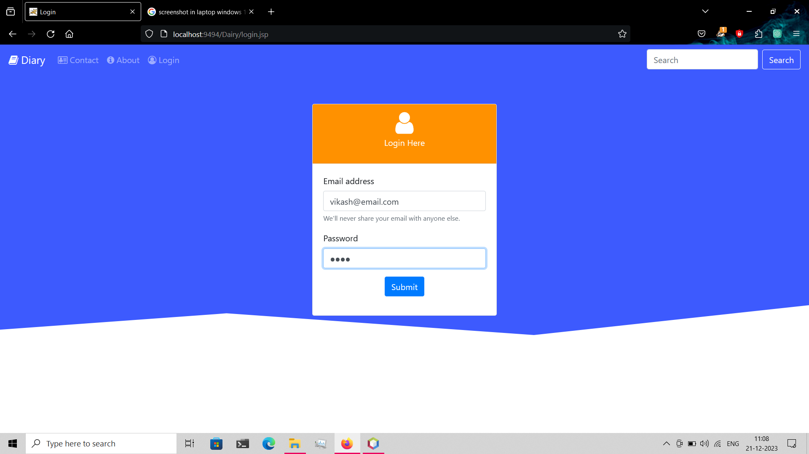
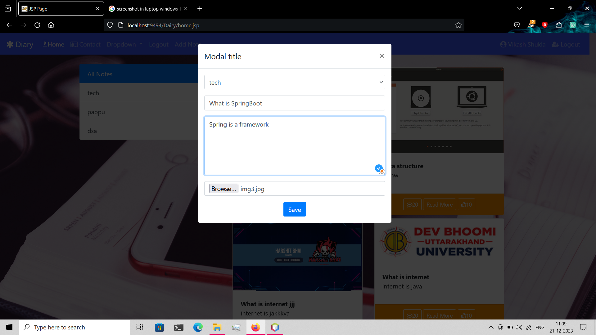
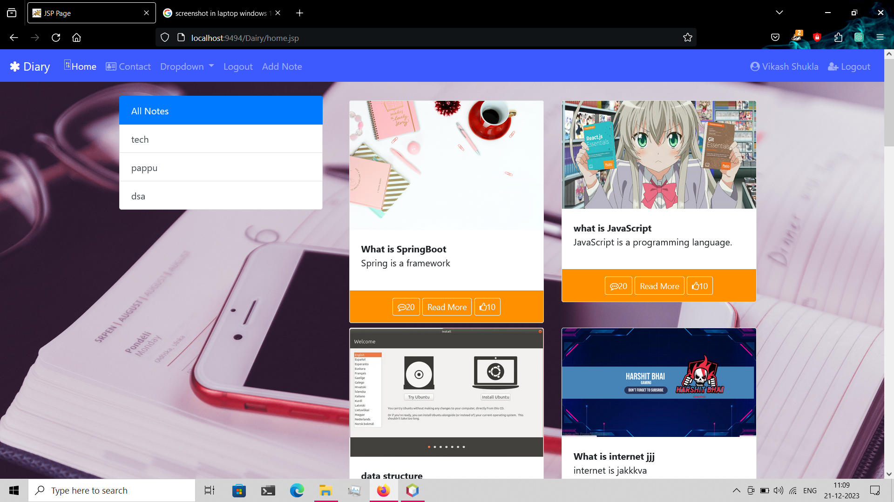
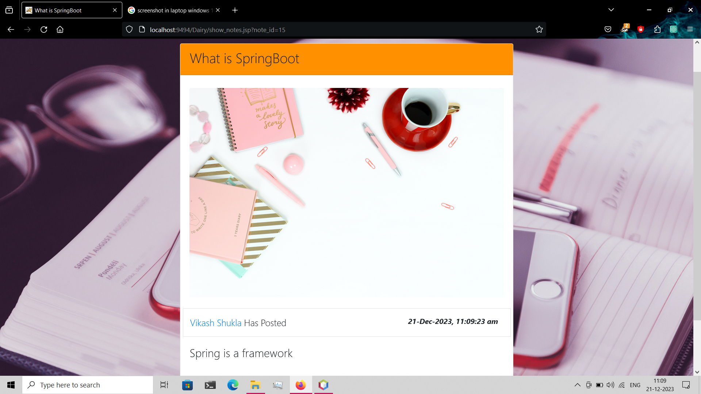
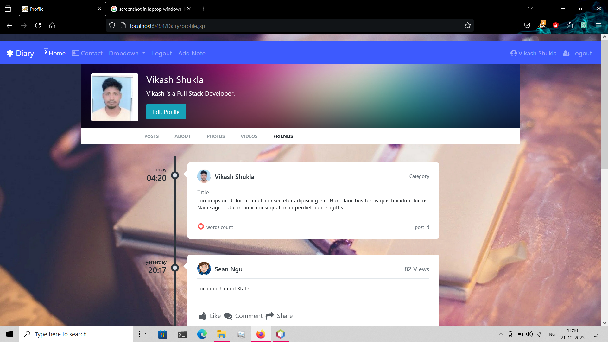
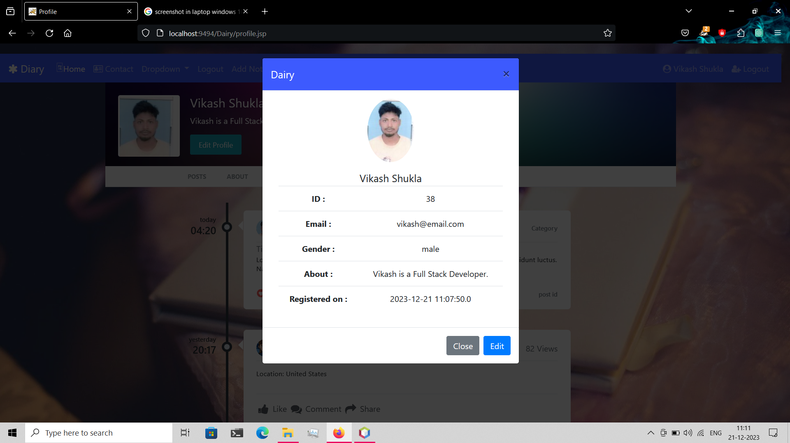
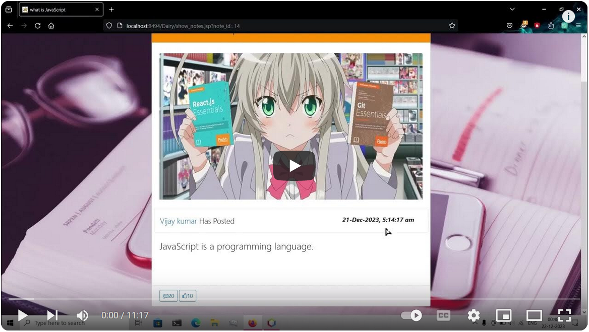

# Digital-Diary

In an era defined by rapid technological advancements, where the digital realm seamlessly intertwines with our daily lives, traditional practices often undergo transformative changes. One such evolution is witnessed in the realm of personal reflection and introspection through the advent of digital diaries.

A digital diary is a modern interpretation of the classic handwritten journal, now residing in the digital landscape. It provides a dynamic platform for individuals to chronicle their thoughts, experiences, and emotions in a format that aligns with the pace and preferences of our tech-driven world.


## Installation

Install my-project

```bash
  Download project and import it in NetBeans
  Make sure you have installed and setup TomCat 9 server
```

Next Step is create database, I used MySql.

Database Name : 
            ``` dairy  ```
    
Tables : 

        ``` categories
                    cid (int)
                    name (String)
                    description (String)
                    
            notes
                    pid (int)
                    pPic (String)
                    catId (int) 
                    pDate (Timestamp)
                    pTitle (String)
                    pContent (String)
                    userId (int)

            user
                    id (int)
                    name (String)
                    email (String)
                    password (String)
                    gender (String)
                    about (String)
                    rdate (Timestamp)
                    profile (String)
             ```
## Screenshots

Main Page


Sign UP Page


Log In Page


Add Note Page


Home Page


View Note Page


User Profile Page


Edit User Profile Page


## Video
Watch The Video for Demo
[](https://youtu.be/X8SkwRLEeAI)

## Features

- Support Multi user
- User state management
- Signup
- Login
- Profile Edit
- Add notes
- View notes
- Notes Categories


## Author Profile

- [@github](https://www.github.com/vijay320)
- [@LinkedIn](https://www.linkedin.com/in/koder-vijay/)

